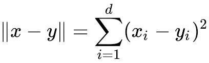
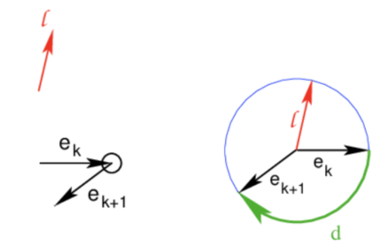

# Tractography Metrics
Evaluation of tractograms using diffusion and geometrical metrics.

## Functionality

With this tool you will be able to compute and view in a fast and compact way multiple statistics about a fiber bundle.
For each stats the value representing the mean, median and standard deviation are computed, as well as the maximum and
minimum boundaries. Allowing the progress of studies based on descriptive statistics and quantitative information.

The stats currently supported are:

* **Bundle Proprieties**
    * Number of fibers
    * Number of points
* **Geometrical Proprieties**
    * Lengths
    * Shortest path
    * Turning angle
* **Connectivity Proprieties**
    * Seeds position
    * Termination position
    * Mid-point position
* **Diffusion Proprieties**
    * b-zero intensity
    * FA value
    * MD value
    
Additionally, a seamless 3DSlicer integrations enables an interactive and immediate fiber analysis, complemented
by behaviour graphs. 

## Metrics

**Number of fibers**: the total number of streamlines composing the tractogram.

**Number of points**: the total number of points composing a streamline

**Length**: Total length of the fiber (in mm) computed by adding up the lengths of all the streamline segments. The euclidean distance is used for the length computation.



**Shortest Path**: Length of the straight segmented connecting the two endpoints of a fiber.

**Turning Angle**: Total turning angle projected (Winding). Cumulative signed
    angle between each line segment and the previous one, expressed in degrees.



**Seeds position**: Position of the starting point (seed) of a streamline

**Termination position**: Position of the endpoint (termination condition respected) of a streamline

**Mid-point position**: Position of the central point of a streamline

**b-zero**: Mapping of every point of the streamline on the baseline image. The exact mapped value is computed with a weighted interpolation of the b-zeros of the 12-connected voxel space around the point.

**FA value**: Mapping of every point of the streamline on the FA map.

**MD value**: Mapping of every point of the streamline on the MD map.

_____

**Max**: Maximum value

**Min** Minimum value

**Std**: Standard deviation

**Median**: Median (central) value

## Installation and Usage.

To set up TractographyMetrics the first thing you need to do is obtaining a copy of it.

To download TractographyMetrics the first thing you should do is open a terminal and move to the directory where you want it to
be installed.

For example, for an installation in the desktop of a MacOS system write:
```sh
$ cd /User/youraccountname/Desktop
```

Get a copy using git:
```sh
$ git clone https://github.com/aledelmo/TractographyMetrics
```

Enter in your freshly downloaded folder:
```sh
$ cd TractographyMetrics
```

Some dependencies are required for a smooth experience. To install everything needed, simply run:
```sh
$ pip install -r requirements.txt
```

Dependencies: **dipy**, **VTK**, **XlsxWriter** <br />
Python3 Compatibility Dependencies: **future**, **six** <br />

Get the tractogram generated by your favourite software and run:
```sh
$ python -m tractography_metrics.py <tractogram_filepath> <output_txt_file>
```

You should now be able to find all the stats that you were looking for in your newly created text file.

To add diffusion information to the analysis make use of the following optional keywords:

| short flag | long flag | Action |
| ------ | ------ | ------ |
| ```-bzero <filepath>``` | ```--b_zero <filepath>``` | Compute stats on the bzero volume  |
| ```-fa <metric_filepath>``` | ```--Fractional_Anisotropy <metric_filepath>``` | Compute stats on the FA metric volume |
| ```-md <metric_filepath>``` | ```--metric_filepath``` | Compute stats on the MD metric volume |

If you prefer to have yout output in a different format use the optional flags:

| short flag | long flag |
| ------ | ------ |
| ```-csv``` | ```--save_csv``` |
| ```-xlsx``` | ```--save_xlsx``` |

These allows to obtain, respectively, a CSV and an Excel output file

Additionally, tu further customize your output with an header use:

| short flag | long flag | Action |
| ------ | ------ | ------ |
| ```-hd <text>``` | ```--header <text>``` | Add any string of text to the stats |

If you are working on huge amount of fibers and you are experiencing computational time issues you can try to
downsample the tractogram:

| short flag | long flag | Action |
| ------ | ------ | ------ |
| ```-r <resampling_percentage>``` | ```--resample <resampling_percentage>``` | Specify the downsample percentage of the tractogram fibers (value between 0 and 100) |

To update the tool, once entered in the folder using a terminal, use the command:
 ```sh
$ git pull
```

It is very important to keep the tool up-to-date to always receive the bug-fixes and to enable the newly developed
functionality.

## Development

###### New Features !!!

  - Now compatible for 3DSlicer 4.9.*
  
###### Todos:

 - Plots in Python interpreter

## Other repositories

This tool is part of a complete segmentation and diffusion framework. It can be complemented by:
* [3DSlicer Plug-ins]: segmentation and diffusion extension for 3DSlicer
* [PQL]: the first ever method for the segmentation of pelvic tractograms.
* [Vessel Segmentation]: deep-learning based approach for the automatic recognition of veins and arteries.
* [IMAG2 Utilities]: collection of various scripts.
* [IMAG2 Website]: completely redesigned team website (<http://www.imag2.org>)
* [IMAG2 Docs]: general and process documentation

 
 License
----

Apache License 2.0

[//]: #
   [3DSlicer Plug-ins]: <https://github.com/aledelmo/3DSlicer_Plugins>
   [PQL]: <https://github.com/aledelmo/PQL>
   [Tractography Metrics]: <https://github.com/aledelmo/TractographyMetrics>
   [Vessel Segmentation]: <https://github.com/aledelmo/VesselsSegmentation>
   [IMAG2 Utilities]: <https://github.com/aledelmo/IMAG2_Utilities>
   [IMAG2 Website]: <https://github.com/aledelmo/IMAG2_Website>
   [IMAG2 Docs]: <https://github.com/aledelmo/IMAG2_docs>
